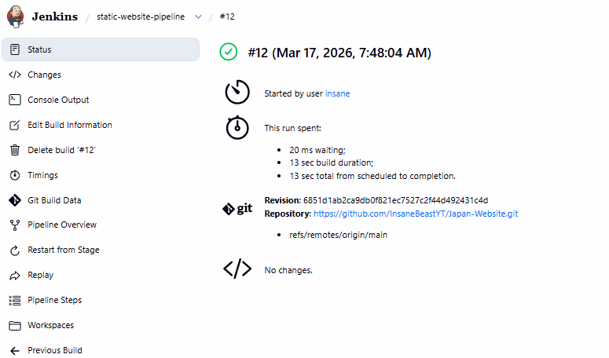
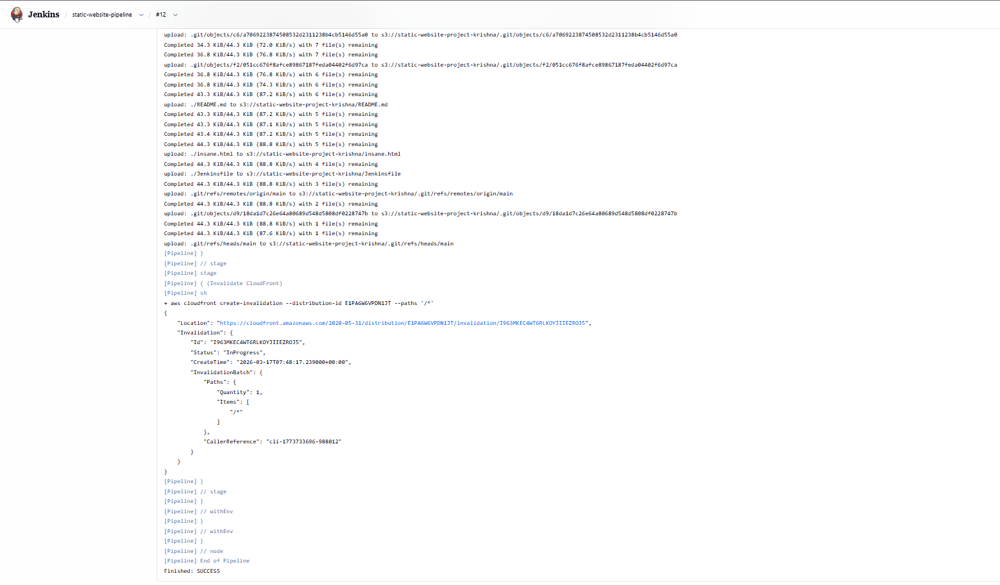
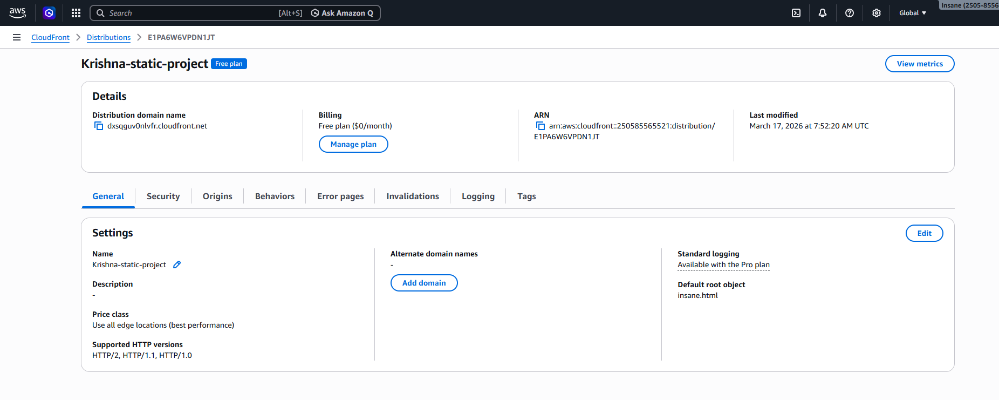

# 🚀 Automated CI/CD Pipeline using Jenkins & AWS

## 📌 Project Overview

This project demonstrates a complete CI/CD pipeline that automates the deployment of a static website using Jenkins and AWS services.

The pipeline fetches code from GitHub, deploys it to AWS S3, and distributes it globally using CloudFront.

---

## 🏗️ Architecture

```
GitHub → Jenkins → EC2 Agent → S3 Bucket → CloudFront → End User
```

---

## 🧰 Tech Stack

* Jenkins (CI/CD)
* AWS EC2 (Compute)
* AWS S3 (Storage)
* AWS CloudFront (CDN)
* GitHub (Version Control)
* HTML, CSS, JavaScript

---

## ⚙️ Workflow

1. Developer pushes code to GitHub
2. Jenkins pipeline is triggered
3. Code is cloned from repository
4. Files are uploaded to S3 bucket
5. CloudFront cache is invalidated
6. Updated website is served globally

---

## 📸 Screenshots
### ✅ Final Website Output


### ✅ Jenkins Pipeline Success



---

### ✅ Jenkins Console Output



---

### ✅ S3 Bucket Files


---

### ✅ CloudFront Distribution



---


---


---

🔹 Step 1: Launch EC2 Instance

Launch Amazon Linux EC2

Open ports:

22 (SSH)

8080 (Jenkins)

🔹 Step 2: Install Jenkins
sudo yum update -y
sudo yum install java-17-amazon-corretto -y
sudo wget -O /etc/yum.repos.d/jenkins.repo https://pkg.jenkins.io/redhat-stable/jenkins.repo
sudo rpm --import https://pkg.jenkins.io/redhat-stable/jenkins.io.key
sudo yum install jenkins -y
sudo systemctl start jenkins
sudo systemctl enable jenkins
🔹 Step 3: Setup Jenkins

Access Jenkins via:

http://<EC2-IP>:8080

Unlock using:

sudo cat /var/lib/jenkins/secrets/initialAdminPassword
🔹 Step 4: Attach Extra Storage (EBS)

Create EBS volume

Attach to EC2 (/dev/xvdb)

Mount:

sudo mkfs -t xfs /dev/xvdb
sudo mount /dev/xvdb /tmp

👉 Fixes disk space issue

🔹 Step 5: Create S3 Bucket

Enable static website hosting

Upload files OR use Jenkins

Disable block public access

Add bucket policy (public read)

🔹 Step 6: Create CloudFront Distribution

Origin → S3 bucket

Default root object → index.html

Wait for deployment

🔹 Step 7: Setup Jenkins Pipeline

Create new pipeline

Connect GitHub repo

🔹 Step 8: Jenkinsfile
pipeline {
    agent { label 'agent-1' }

    environment {
        AWS_DEFAULT_REGION = 'ap-south-1'
        S3_BUCKET = 'static-website-project-krishna'
        DISTRIBUTION_ID = 'YOUR_DISTRIBUTION_ID'
    }

    stages {

        stage('Clone Code') {
            steps {
                git branch: 'main', url: 'https://github.com/InsaneBeastYT/Japan-Website.git'
            }
        }

        stage('Deploy to S3') {
            steps {
                sh '''
                aws s3 sync . s3://$S3_BUCKET --delete
                '''
            }
        }

        stage('Invalidate CloudFront') {
            steps {
                sh '''
                aws cloudfront create-invalidation \
                --distribution-id $DISTRIBUTION_ID \
                --paths "/*"
                '''
            }
        }
    }
}
🔹 Step 9: Setup Jenkins Agent (EC2)

Create new node

Add SSH credentials (PEM key)

Set:

Launch agents via SSH

Fix verification:

Non verifying strategy

## 💡 Key Features

* Fully automated deployment pipeline
* Global content delivery using CDN
* Real-world DevOps implementation
* Scalable and efficient architecture

---

## 🧠 Challenges Faced & Solutions

* Disk space issue in Jenkins → Fixed using EBS volume
* SSH connection failure → Fixed using correct PEM key and configuration
* Jenkins agent not connecting → Fixed SSH and verification strategy
* CloudFront DNS delay → Waited for propagation
* 404 Error → Fixed by placing index.html in root of S3

---

## 🎯 Learning Outcomes

* CI/CD pipeline creation
* AWS services integration
* Debugging real-world infrastructure issues
* Automation of deployment process

---

## 🚀 Future Improvements

* Add GitHub Webhooks for automatic triggers
* Use Docker for containerization
* Enable HTTPS using AWS ACM
* Add monitoring using CloudWatch

---
## 🌐 Live Demo

The project was successfully deployed using AWS S3 and CloudFront.  
Due to cost optimization, the live deployment has been removed.  

Please refer to the screenshots and demo video for proof of deployment.
